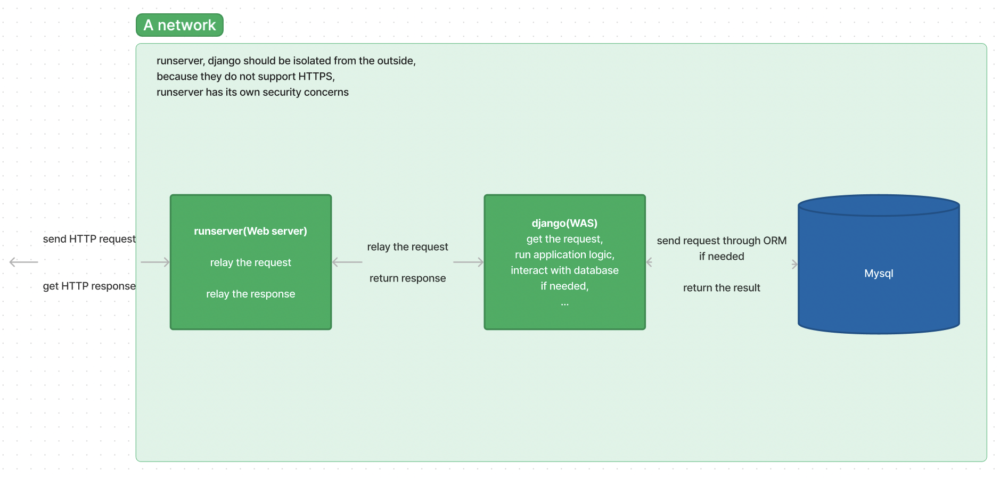
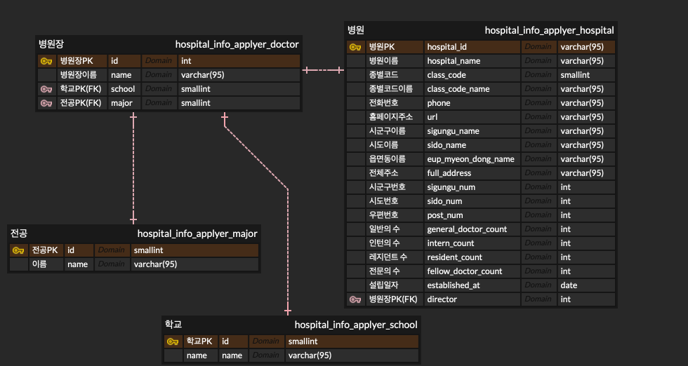
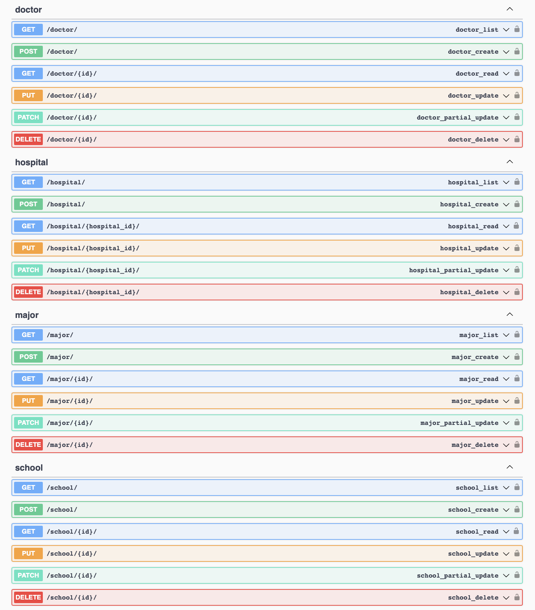

## Description

</img>

</img>

This project runs a WAS for registering information about hospital, doctor, major, school, and returning them corresponding to received HTTP request.

<br>

Note that the project does not supoort HTTPS.

Make sure to hide mysql_setting.yaml, secret_key.yaml to a safe place, modify settings.py to load these from the place.

For the fields doctor.major, doctor.school, and hospital.director, it is okay to temporarily set them as null, before assigning values to major, school, and director, respectively.

The fields hospital.phone, hospital.url, hospital.eup_myeon_dong_name, and hospital.established_at can also be set as null, based on the provided fixture data.

<br>

The project is based on django rest framework.

The hospital information is from [this open api](https://www.data.go.kr/data/15001698/openapi.do#/layer-api-guide).


<br>

## Give it a try!

make the proejct containers by:

```
docker-compose up
```


<br>

wait about 30 seconds for mysql and the WAS to startup, run test or insert fixture to the WAS by:

```
(for test) cd hospital_info_system && python manage.py test hospital_info_applyer


(for inserting fixture to the WAS) 

cd hospital_info_system 

python manage.py loaddata hospital_info_applyer/fixtures/all_hospital_info.jsonl

nohup python manage.py runserver 0.0.0.0:8000 --insecure &
```

note that other fixtures are ready in hospital_info_applyer/fixtures, too.


<br>

the swagger document is like the below, in the case of inserting fixture to the WAS, you can see it through 127.0.0.1:8001/swagger from your host by default:

</img>


<br>

## License

MIT